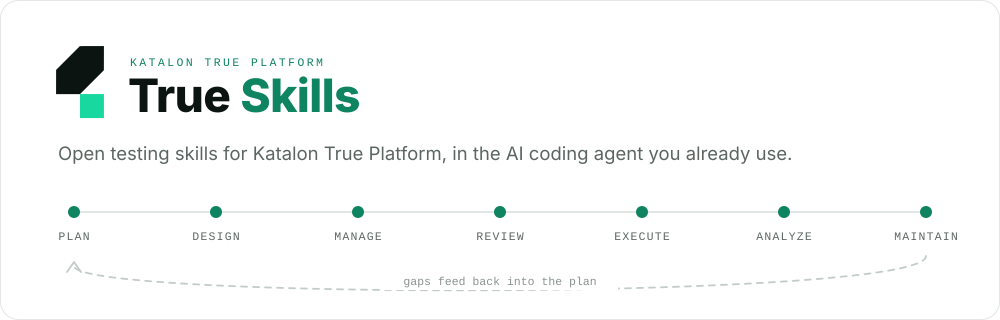
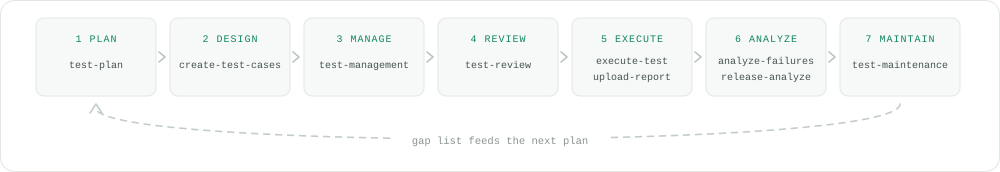

<div align="center">

<picture>
  <source media="(prefers-color-scheme: dark)" srcset="docs/images/hero-dark.svg">
  
</picture>

[](LICENSE)   

[Quickstart](#quickstart) · [Skills](#the-skills) · [Lifecycle](#the-lifecycle) · [Install](#install) · [MCP](#connect-the-katalon-mcp) · [Contributing](CONTRIBUTING.md)

</div>

Ask your coding agent to read a requirement, design the test cases, run them with AI, upload the reports, and tell you whether the release is safe to ship. The skills do the platform work through the Katalon MCP, so the agent operates your real project instead of guessing at it.


<sub>An example session. Your requirement keys, suites, and verdicts come from your own workspace.</sub>

## Quickstart

**1. Install the skills.** The [`skills` CLI](https://github.com/vercel-labs/skills) detects the agent you already run (70+ supported) and drops the skills into its native directory.

```bash
npx skills add katalon-labs/true-skills
```

**2. Point it at your Katalon workspace.** Add the MCP server to your agent's config file (the [install section](#install) says which file yours is):

```json
{
  "mcpServers": {
    "katalon-prod-mcp": {
      "command": "npx",
      "args": ["-y", "mcp-remote", "https://<your.sub.domain>.katalon.io/mcp", "--transport", "http-first"]
    }
  }
}
```

First connect opens a browser OAuth flow. No tokens to paste, no keys to store.

**3. Ask for something real.**

```text
Set up Katalon MCP and verify my projects.
Create manual tests from requirement CEL-6 and link them.
Which requirements in this sprint have no test coverage?
Run that suite with AI and summarize what broke.
Generate a Playwright script from test case TC-1042.
Upload my Playwright report to Katalon and verify the run.
Is release 3.2 safe to ship?
```

Or hand over the whole chain: *"Analyze CEL-6, design and import the cases, build a suite, run it with AI, and tell me if we can ship."*

## The skills

Thirteen skills, one folder each under [`skills/`](skills/). The agent picks the right one from its description, so you rarely name a skill yourself.

| Skill | Stage | What it does |
| --- | --- | --- |
| [platform-setup](skills/platform-setup/SKILL.md) | setup | Installs and verifies the Katalon MCP, and diagnoses auth or access failures. Start here. |
| [test-plan](skills/test-plan/SKILL.md) | 1 plan | Turns quality goals into scope, ranks the work by requirement coverage and risk, and builds the folder and suite structure that acts as the executable plan. |
| [create-test-cases](skills/create-test-cases/SKILL.md) | 2 design | Reads a requirement or free text, designs atomic manual cases with ISTQB techniques as reference, skips duplicates, imports only what is missing, and links each case back to the requirement. |
| [test-management](skills/test-management/SKILL.md) | 3 manage | Organizes folders and suites, finds assets at scale, and produces a requirement to case to suite traceability report with coverage percentage and orphans. |
| [test-review](skills/test-review/SKILL.md) | 4 review | Reviews coverage, case quality, and flakiness before anything enters the pipeline, and returns Approve, Approve with fixes, or Reject plus the specific weak cases. |
| [execute-test](skills/execute-test/SKILL.md) | 5 execute | Runs a case, a list, or a suite as a manual run, a Run with AI session, or scheduled automation, then reports pass, fail, and blocked. |
| [upload-report](skills/upload-report/SKILL.md) | 5 execute | Runs automation and uploads or verifies Katalon Studio/KRE, JUnit XML, and Playwright reports on the platform. |
| [test-case-to-playwright](skills/test-case-to-playwright/SKILL.md) | 5 execute | Converts manual cases into Playwright TypeScript with Page Object Model and fixtures. |
| [playwright-execute](skills/playwright-execute/SKILL.md) | 5 execute | Runs Playwright specs, ships the report with `@katalon/playwright-reporter`, and verifies the run landed. |
| [analyze-failures](skills/analyze-failures/SKILL.md) | 6 analyze | Sorts failures into product defect, automation defect, and environment noise, clusters them by signature, and files ALM defects for the real bugs. |
| [release-analyze](skills/release-analyze/SKILL.md) | 6 analyze | Reads coverage, stability, and defect data to return Ready, Ready with risk, or Not ready, with the reasons attached. |
| [test-maintenance](skills/test-maintenance/SKILL.md) | 7 maintain | Finds flaky and broken cases from stability history, repairs or regenerates them, and hands the refreshed gap list back to planning. |
| [true-platform-testing](skills/true-platform-testing/SKILL.md) | all | The router and end to end runner. Routes any request to the right stage, or drives the full chain from requirement to ship decision. |

Multi-skill playbooks live in [`combination-recipes.md`](skills/true-platform-testing/references/combination-recipes.md). Copy-paste prompts and cross-model notes are in [`prompt-recipes.md`](skills/true-platform-testing/references/prompt-recipes.md).

## The lifecycle

Seven stages, each owned by a skill. The loop closes when maintenance feeds its gap list back into the plan.

<picture>
  <source media="(prefers-color-scheme: dark)" srcset="docs/images/lifecycle-dark.svg">
  
</picture>

`platform-setup` sits before all seven, connecting the MCP. Every skill states which Katalon MCP tools it uses and where the platform stops. Full stage map: [`lifecycle-map.md`](skills/true-platform-testing/references/lifecycle-map.md). Every tool in one line each: [`mcp-tool-index.md`](skills/true-platform-testing/references/mcp-tool-index.md). A self-contained visual for humans: [`docs/lifecycle.html`](docs/lifecycle.html).

## Where the boundary is

Each skill names its limits up front so the agent does not promise work the platform cannot do.

**Through the MCP:** list projects and repositories, read requirements, create and update and link test cases, manage suites and folders, create manual runs, start Run with AI, poll AI sessions, read results, fetch quality metrics, and file ALM-linked defects.

**Not through the MCP:** creating requirements, creating a formal Test Plan entity, guaranteeing an AI run finishes, or inspecting the live app UI without a browser tool. A named suite plus a release or sprint association stands in for the Test Plan entity.

Some work is a product surface rather than an API call: object capture and resilience design in Studio, custom fields and Git config and governance in the TestOps UI, self-healing and Time Capsule and TrueTest regeneration, and rerun, terminate, and Live Monitor. The full list is in [`unavailable-capabilities.md`](skills/true-platform-testing/references/unavailable-capabilities.md).

## Install

Every path needs the [Katalon MCP](#connect-the-katalon-mcp) configured.

<details open>
<summary><b>Any agent</b> via the <code>skills</code> CLI</summary>

```bash
npx skills add katalon-labs/true-skills                          # all skills, this project
npx skills add katalon-labs/true-skills --skill platform-setup   # just one
npx skills add katalon-labs/true-skills -g                       # user-global, every agent
npx skills update                                                # pull the latest
```

The CLI installs skill files only. Configure the MCP yourself with the snippet below, or use the Claude Code and Codex plugin paths, which bundle it.
</details>

<details>
<summary><b>Claude Code</b> plugin marketplace</summary>

```bash
claude plugin marketplace add katalon-labs/true-skills
claude plugin install katalon-true-platform@katalon-true-platform-marketplace
```

Developing against a checkout:

```bash
claude --plugin-dir plugins/katalon-true-platform
```

The plugin ships the skills and an `.mcp.json`. If your setup does not auto-load the bundled MCP, add it manually.
</details>

<details>
<summary><b>Codex</b> plugin marketplace</summary>

```bash
codex plugin marketplace add katalon-labs/true-skills
```

Open **Plugins** in Codex and install **Katalon True Platform**. Set your subdomain in the plugin's `.mcp.json`.
</details>

<details>
<summary><b>GitHub Copilot</b> prompt files</summary>

```bash
mkdir -p .github && cp -R <checkout>/.github/prompts .github/ \
  && cp <checkout>/.github/copilot-instructions.md .github/ \
  && mkdir -p .vscode && cp <checkout>/.vscode/mcp.json .vscode/
```

In Copilot Chat, call a skill with `/platform-setup` or `/true-platform-testing`. Set your subdomain in `.vscode/mcp.json`.
</details>

<details>
<summary><b>Cursor</b> project rules</summary>

```bash
cp -R <checkout>/.cursor .cursor
```

Rules in `.cursor/rules/*.mdc` load by description when relevant. MCP config lives in `.cursor/mcp.json`.
</details>

<details>
<summary><b>Kiro</b> steering docs</summary>

```bash
cp -R <checkout>/.kiro .kiro
```

Steering docs use manual inclusion, so reference one in chat with `#true-platform-testing`. MCP config lives in `.kiro/settings/mcp.json`.
</details>

<details>
<summary><b>Windsurf</b> rules</summary>

```bash
cp -R <checkout>/.windsurf .windsurf
```

Rules in `.windsurf/rules/*.md` trigger on their description. Add the MCP under **Settings → MCP**, or in `~/.codeium/windsurf/mcp_config.json`.
</details>

<details>
<summary><b>Cline</b> project rules</summary>

```bash
cp -R <checkout>/.clinerules .clinerules
```

Cline loads every file in `.clinerules/`. Add the MCP through its **MCP Servers** panel.
</details>

<details>
<summary><b>Continue</b> rules and MCP block</summary>

```bash
cp -R <checkout>/.continue .continue
```

Rules live in `.continue/rules/*.md`, the MCP block in `.continue/mcpServers/katalon.yaml`.
</details>

<details>
<summary><b>Anything else</b> via AGENTS.md</summary>

Point your agent at [`AGENTS.md`](AGENTS.md). It indexes every skill and tells the agent to open `skills/<name>/SKILL.md`. Use the root [`.mcp.json`](.mcp.json) for the server config.
</details>

## Connect the Katalon MCP

The command is the same for every agent. Only the surrounding config file changes. The canonical shape lives in [`.mcp.json`](.mcp.json):

```json
{
  "mcpServers": {
    "katalon-prod-mcp": {
      "command": "npx",
      "args": ["-y", "mcp-remote", "https://<your.sub.domain>.katalon.io/mcp", "--transport", "http-first"]
    }
  }
}
```

1. Replace `<your.sub.domain>` with your Katalon workspace subdomain.
2. Complete the browser OAuth flow that `mcp-remote` opens on first connect.
3. Reload the agent if the tools do not show up.

> **Auth is browser OAuth only.** Never paste passwords, API tokens, cookies, JWTs, MFA codes, or OAuth callback URLs into chat, and never commit them. The skills enforce this.

## How it is built

The skill bodies live once. Everything each agent needs is generated from them, so no adapter can drift.

```text
  skills/                      13 SKILL.md files plus references/
     |
     |  node scripts/build-adapters.mjs      deterministic, checked in CI
     v
  Claude Code · Codex · Copilot · Cursor · Kiro · Windsurf · Cline · Continue · AGENTS.md
     |
     |  every adapter points at the same server
     v
  Katalon MCP  ->  requirements, test cases, suites, Run with AI, results, defects
```

```text
skills/                              source of truth, 13 skills
scripts/build-adapters.mjs           generates every agent config
plugins/katalon-true-platform/       Claude Code and Codex plugin      (generated)
.claude-plugin/  .agents/            plugin marketplaces               (generated)
.cursor/  .kiro/  .github/           Cursor, Kiro, Copilot             (generated)
.windsurf/  .clinerules/  .continue/ Windsurf, Cline, Continue         (generated)
.mcp.json  .vscode/mcp.json          MCP config                        (generated)
AGENTS.md  llms.txt                  agent-readable index              (generated)
```

## Contributing

Edit `skills/` only. Everything else is generated. Then:

```bash
node scripts/validate-skills.mjs    # skills/ matches scripts/skills.config.mjs
node scripts/build-adapters.mjs     # regenerate every agent config
```

The build is deterministic. Re-running it with no skill changes produces no diff, and CI rejects out-of-sync adapters. Details in [CONTRIBUTING.md](CONTRIBUTING.md).

## License

[MIT](LICENSE) © Katalon. "Katalon" and "Katalon True Platform" are trademarks of Katalon, Inc.
