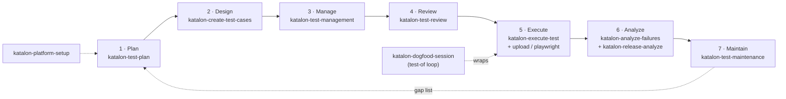

<div align="center">

</div>

```text
 _____ ____  _   _ _____   ____  _  _____ _     _     ____
|_   _|  _ \| | | | ____| / ___|| |/ /_ _| |   | |   / ___|
  | | | |_) | | | |  _|   \___ \| ' / | || |   | |   \___ \
  | | |  _ <| |_| | |___   ___) | . \ | || |___| |___ ___) |
  |_| |_| \_\\___/|_____| |____/|_|\_\___|_____|_____|____/
```

**Open testing skills for Katalon True Platform, for every AI coding agent.**

Design test cases, run them with AI, upload reports, and call release readiness, straight from your agent's chat. Author the skills once; native config is generated for Claude Code, Codex, GitHub Copilot, Cursor, Kiro, Windsurf, Cline, Continue, and any agent that reads `AGENTS.md`.

[](LICENSE) &nbsp;·&nbsp; 14 skills &nbsp;·&nbsp; 7-stage lifecycle &nbsp;·&nbsp; 8+ agents &nbsp;·&nbsp; 1 MCP



## How it fits together

```text
   skills/   one source of truth  (14 SKILL.md + references)
      |
      |   node scripts/build-adapters.mjs        deterministic, CI-checked
      v
   .--------------------- native config per agent ----------------------.
   |  Claude Code     Codex        Copilot        Cursor        Kiro     |
   |  Windsurf        Cline        Continue       AGENTS.md (any other)  |
   '----------------------------------+---------------------------------'
      |   every adapter points at the same MCP
      v
   Katalon MCP    npx mcp-remote https://<your.sub.domain>.katalon.io/mcp    OAuth
      |
      v
   Katalon True Platform    requirements -> tests -> Run with AI -> reports
```

---

## What this is

A single, well-tested set of **Katalon True Platform / TestOps testing skills** that any AI coding agent can use. The skill bodies live once in [`skills/`](skills/). A deterministic [build script](scripts/build-adapters.mjs) turns them into each agent's native format - a Claude/Codex plugin, Cursor rules, Kiro steering docs, Copilot prompt files, and more - so the same instructions work the same way no matter which agent you run.

Everything talks to the **Katalon MCP server**, so the agent operates your real platform: it reads requirements, designs and imports test cases, builds suites, runs them with AI, uploads Playwright/JUnit/Katalon reports, and assesses release readiness.

> **For AI agents:** read [`AGENTS.md`](AGENTS.md) for the skill index, then open `skills/<name>/SKILL.md` for the workflow you need. Start with `katalon-platform-setup` to connect the MCP.

### Requirement to execution, one prompt

```text
  1. analyze requirement     ->  intent, flows, risk areas
  2. design + import cases   ->  coverage via ISTQB techniques, linked to the requirement
  3. build suite             ->  the executable "test plan"
  4. Run with AI             ->  execute + poll to completion
  5. upload reports          ->  Katalon / JUnit / Playwright
  6. release call            ->  Ready / Ready with risk / Not ready
```

Each step maps to a skill. Run the whole chain with `katalon-trueplatform-testing`, or call any step on its own.

## The testing lifecycle

The skills cover the **whole software testing workflow, from plan to insight** - seven stages, each with dedicated skills and the exact Katalon MCP tools behind them. `katalon-trueplatform-testing` routes any request to the right stage; the loop closes when maintenance feeds gaps back into planning.



```text
STAGE          SKILL(S)                          KEY KATALON MCP TOOLS
1 Plan         katalon-test-plan                 list_projects, list_repositories, find_iterations,
                                                  fetch_requirement_data, find_test_cases_by_requirement,
                                                  manage_test_folder, manage_test_suite
2 Design       katalon-create-test-cases         find_requirements, read_requirement, create_test_case,
               (+ ...-to-playwright-script)       read_test_case, update_test_case, find_test_cases
3 Manage       katalon-test-management           find_test_folders, manage_test_folder, find_test_suites,
                                                  manage_test_suite, move_test_case, link_requirements_to_test_case,
                                                  unlink_requirements_from_test_case, find_test_cases_by_requirement
4 Review       katalon-test-review               fetch_requirement_data, fetch_test_case_data,
                                                  fetch_test_stability_data, fetch_test_configuration_data
5 Execute      katalon-execute-test              read_auts, create_manual_test_run, create_manual_ai_session,
               (+ upload-report,                  read_manual_ai_session, find_execution_profiles,
                  playwright-execute)              list_test_cloud_environments, build_run_configuration,
                                                  build_schedule, schedule_test_run, read_execution
6 Analyze      katalon-analyze-failures          read_test_result, read_execution_test_results, find_test_results,
               + katalon-release-analyze          fetch_defect_data, find_alm_integration_projects, create_defect
7 Maintain     katalon-test-maintenance          fetch_test_stability_data, find_test_results, read_execution,
                                                  update_test_case, move_test_case, duplicate_test_case
                                                        |
                                                        +--> gap list feeds back into 1 Plan (loop closes)

cross-cutting  katalon-platform-setup (connect the MCP)
               katalon-dogfood-session (durable test-of / dogfooding session)
               katalon-trueplatform-testing (lifecycle router + end-to-end runner)
```

Some steps are **product surfaces, not MCP calls** - object capture and resilience design (Studio), custom fields / Git config / governance (TestOps UI), self-healing / Time Capsule / TrueTest regeneration, and rerun / terminate / Live Monitor. Each skill states its boundary so the agent never over-promises. See `skills/katalon-trueplatform-testing/references/lifecycle-map.md` for the full map and `references/mcp-tool-index.md` for every tool.

A self-contained visual of the lifecycle for humans lives at [`docs/lifecycle.html`](docs/lifecycle.html) (open it in a browser). Machine-readable discovery for AI agents: [`AGENTS.md`](AGENTS.md) and [`llms.txt`](llms.txt).

## Skills

Setup first, then lifecycle order, orchestrator last. **Bold** = the stage owner.

| Skill | Stage | What it does |
| --- | --- | --- |
| **katalon-platform-setup** | pre | Install, connect, and verify the Katalon MCP. Diagnose auth/access. Always start here. |
| **katalon-test-plan** | 1 Plan | Translate quality goals into scope, prioritize by requirement coverage and risk, and build the executable folder+suite+release structure that stands in for a formal Test Plan. |
| **katalon-create-test-cases** | 2 Design | Analyze a requirement (or free text), design atomic manual cases using ISTQB techniques as a reference, avoid duplicates, import only what's missing, and link requirements. |
| **katalon-test-management** | 3 Manage | Organize inventory (folders/suites/moves), classify and find at scale, and produce a requirement↔case↔suite **traceability** report with coverage % and orphans. |
| **katalon-test-review** | 4 Review | Pre-pipeline coverage, quality, and flakiness review that returns a **verdict** (Approve / Approve with fixes / Reject) plus the specific weak cases. |
| **katalon-execute-test** | 5 Execute | Run an existing case, list, or suite - manual run, Run with AI, or scheduled automation - then summarize pass/fail/blocked. |
| **katalon-upload-report** | 5/6 | Run automation and upload or verify Katalon Studio/KRE, JUnit XML, or Playwright reports on the platform. |
| **katalon-test-case-to-playwright-script** | 2/5 | Convert Katalon manual test cases into Playwright TypeScript with Page Object Model and fixtures. |
| **katalon-playwright-execute** | 5/6 | Run Playwright specs/suites, upload the report to Katalon with `@katalon/playwright-reporter`, and verify the run. |
| **katalon-analyze-failures** | 6 Analyze | Triage failures - product defect vs automation defect vs environment - cluster by signature, and file ALM defects for real product bugs. |
| **katalon-release-analyze** | 6 Analyze | Read quality metrics and results to produce a *Ready / Ready with risk / Not ready* release recommendation. |
| **katalon-test-maintenance** | 7 Maintain | Detect flaky/broken cases from stability and history, repair or regenerate, and feed the refreshed gap list back into planning. |
| **katalon-dogfood-session** | cross | Durable test-of / dogfooding session against a product build: session record, atomic cases, both lanes, cross-verify, defects tagged back. |
| **katalon-trueplatform-testing** | all | The lifecycle **router** + end-to-end runner: requirement → cases → suite → Run with AI → results → report, and routes any request to the right stage. |

Each skill is a folder under [`skills/`](skills/) with a `SKILL.md` and supporting `references/`. Multi-skill playbooks live in `skills/katalon-trueplatform-testing/references/combination-recipes.md`; copy-paste prompts and cross-model/cross-agent notes in `references/prompt-recipes.md`.

## Install

Pick your agent. **Every path needs the [Katalon MCP server](#katalon-mcp-server) configured** - that's the shared step at the bottom.

<details open>
<summary><b>Any agent</b> - <code>skills</code> CLI (auto-detects what you have)</summary>

```bash
npx skills add katalon-labs/true-skills
```

The [open `skills` CLI](https://github.com/vercel-labs/skills) detects your installed coding agent (70+ supported), installs these skills into its native skills directory on demand, and keeps them current:

```bash
npx skills add katalon-labs/true-skills --skill katalon-platform-setup   # one skill
npx skills add katalon-labs/true-skills -g                               # user-global, all agents
npx skills update                                                        # pull latest
```

The CLI installs the **skill files only**; it does not configure MCP. Complete the [Katalon MCP server](#katalon-mcp-server) step afterward. For the bundled-MCP experience on Claude Code or Codex, use the plugin marketplace options below instead.
</details>

<details>
<summary><b>Claude Code</b> - plugin marketplace</summary>

```bash
claude plugin marketplace add katalon-labs/true-skills
claude plugin install katalon-true-platform@katalon-true-platform-marketplace
```

For local development against a checkout:

```bash
claude --plugin-dir plugins/katalon-true-platform
```

The plugin bundles the skills and an `.mcp.json`. If your environment doesn't auto-load the bundled MCP, configure it from [Katalon MCP server](#katalon-mcp-server).
</details>

<details>
<summary><b>Codex</b> - plugin marketplace</summary>

```bash
codex plugin marketplace add katalon-labs/true-skills
```

Then open **Plugins** in Codex and install **Katalon True Platform**. The Codex wrapper declares the MCP server in the plugin's `.mcp.json`; replace `<your.sub.domain>` first.
</details>

<details>
<summary><b>GitHub Copilot</b> - prompt files</summary>

Copy these into your repository:

```bash
mkdir -p .github && cp -R <checkout>/.github/prompts .github/ \
  && cp <checkout>/.github/copilot-instructions.md .github/ \
  && mkdir -p .vscode && cp <checkout>/.vscode/mcp.json .vscode/
```

In Copilot Chat, invoke a skill with `/katalon-platform-setup`, `/katalon-trueplatform-testing`, etc. Edit `.vscode/mcp.json` to set your subdomain.
</details>

<details>
<summary><b>Cursor</b> - project rules</summary>

```bash
cp -R <checkout>/.cursor .cursor
```

Rules in `.cursor/rules/*.mdc` are agent-requested (loaded by description when relevant). MCP is configured in `.cursor/mcp.json` - set your subdomain.
</details>

<details>
<summary><b>Kiro</b> - steering docs</summary>

```bash
cp -R <checkout>/.kiro .kiro
```

Steering docs in `.kiro/steering/*.md` use manual inclusion - reference one in chat with `#katalon-trueplatform-testing`. MCP is configured in `.kiro/settings/mcp.json`.
</details>

<details>
<summary><b>Windsurf</b> - rules</summary>

```bash
cp -R <checkout>/.windsurf .windsurf
```

Rules in `.windsurf/rules/*.md` trigger by model decision on their description. Add the MCP server in **Windsurf → Settings → MCP** (or `~/.codeium/windsurf/mcp_config.json`) using the snippet from [Katalon MCP server](#katalon-mcp-server).
</details>

<details>
<summary><b>Cline</b> - project rules</summary>

```bash
cp -R <checkout>/.clinerules .clinerules
```

Cline loads every file in `.clinerules/`. Add the MCP server through Cline's **MCP Servers** panel with the snippet below.
</details>

<details>
<summary><b>Continue</b> - rules + MCP block</summary>

```bash
cp -R <checkout>/.continue .continue
```

Rules live in `.continue/rules/*.md`; the MCP server block is in `.continue/mcpServers/katalon.yaml`. Set your subdomain there.
</details>

<details>
<summary><b>Any other agent</b> - AGENTS.md</summary>

Point your agent at [`AGENTS.md`](AGENTS.md). It indexes every skill and tells the agent to read `skills/<name>/SKILL.md`. Configure the MCP using [`.mcp.json`](.mcp.json) at the repo root.
</details>

## Katalon MCP server

All skills operate the platform through the Katalon MCP server. The command is identical for every agent - only the surrounding config file differs (the install section tells you which file). The canonical shape is in [`.mcp.json`](.mcp.json):

```json
{
  "mcpServers": {
    "katalon-prod-mcp": {
      "command": "npx",
      "args": ["-y", "mcp-remote", "https://<your.sub.domain>.katalon.io/mcp", "--transport", "http-first"]
    }
  }
}
```

1. Replace `<your.sub.domain>` with the subdomain of your Katalon workspace.
2. On first connect, `mcp-remote` opens a **browser OAuth flow**. Complete login there.
3. Reload your agent if the tools don't appear immediately.

> 🔒 **Security:** authentication is browser/OAuth only. Never paste passwords, API tokens, cookies, JWTs, MFA codes, or OAuth callback URLs into chat or commit them. The skills enforce this.

## Try it

After setup, just ask in your agent's chat:

```text
Set up Katalon MCP and verify my projects.
Create manual tests from requirement CEL-6 and link them.
Run that suite with AI and summarize the results.
Generate a Playwright script from test case TC-1042.
Upload my Playwright report to Katalon and verify the run.
Is release 3.2 ready to ship based on the quality metrics?
```

Or run the whole chain: *"Analyze CEL-6, design and import cases, build a suite, run with AI, and tell me if we can ship."*

## What the platform can and can't do

The skills are explicit about boundaries so the agent never over-promises:

- **Available via MCP:** list projects/repositories, find/read requirements, create/read/update/link test cases, manage suites and folders, create manual runs, start Run with AI, poll AI sessions, read results, fetch quality metrics, create ALM-linked defects.
- **Not directly available:** creating requirements, creating a formal Test Plan entity, guaranteeing AI execution completion, or inspecting the live app UI without a browser tool. (Workaround: a named suite/folder plus release/sprint association acts as the executable test plan.)

See `skills/katalon-trueplatform-testing/references/unavailable-capabilities.md` for the full list.

## Repository layout

```text
skills/                      Single source of truth - 14 skills (SKILL.md + references/)
scripts/build-adapters.mjs   Generates every agent's native config from skills/
plugins/katalon-true-platform/   Claude Code + Codex plugin (generated)
.claude-plugin/ .agents/     Root marketplaces for Claude Code / Codex (generated)
.cursor/ .kiro/ .github/     Cursor / Kiro / Copilot configs (generated)
.windsurf/ .clinerules/ .continue/   Windsurf / Cline / Continue configs (generated)
.vscode/mcp.json  .mcp.json  MCP server config (generated)
AGENTS.md                    Universal fallback for any other agent (generated)
docs/images/                 Diagrams
```

## Contributing

Edit skills in **`skills/` only** - everything else is generated. After any change, validate, regenerate, and commit:

```bash
node scripts/validate-skills.mjs    # skills/ matches scripts/skills.config.mjs
node scripts/build-adapters.mjs     # regenerate every agent's native config
```

The build is deterministic and idempotent: re-running with no skill changes produces no diff. CI runs the validator and rejects out-of-sync adapters. See [CONTRIBUTING.md](CONTRIBUTING.md).

## License

[MIT](LICENSE) © Katalon. "Katalon" and "Katalon True Platform" are trademarks of Katalon, Inc.
